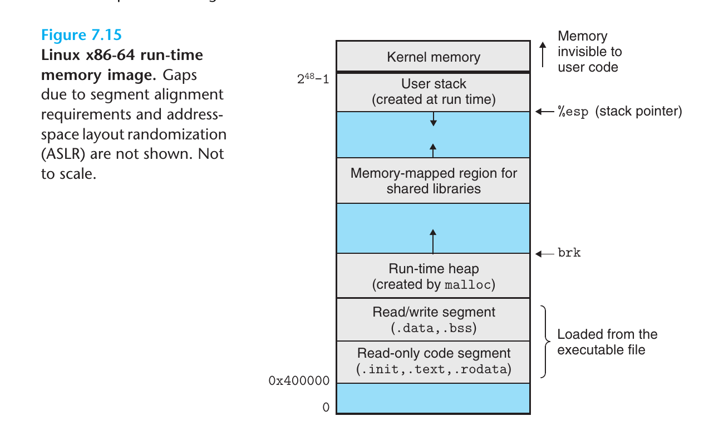

## From source code to program file
            
### pipeline
            preprocesser(like `cpp`0       compiler(like `cc1`)            assembler(like `as`)
source code ----> source code, preprocessed -------> assembly code ---> relocatable object files

        linkers(like `ld`)      loader(normal loader or debugger or custom loader in runtime)
object files ----> program files ----> program

### use compiler driver as an agent
            compiler driver(like gcc)
source code ----> program

## ELF format

Things about `relocatable object files`(including `shared object file`) are below, but in an `executable object file`, a lot of those can be omitted, like `.rel data` and `.rel text` is not needed in a executable, if it is static linked.

### `.bss`

1. Uninitialized global and static variables, also variables initialized to 0
2. Do not take space in fact
3. from IBM assembly language, Block started By Symbols

### `.data` `.rodata` `.symtab`

1. `.rodata`, readonly data like string literals
2. `.data`, global variables

### `.rel data` `.rel text`

Data and instructions not in the current object file, relocating needed

### Debug: `.symtab` and `.line` and `.debug`

1. `.symtab`, symbol tables, all global variables names and function names, get rid of it only with `strip` command when compiling; 
2. `.line` line number the instructions correspond to the source code files, only seen when `-g` option is provied in compilation
3. `.debug` only seen with `-g`; including variables(local and global) and their names and types

### Symbols, how compiler do strange things

1. More than one strong symbols(defined symbols, like `main` `int a` in global section) are not allowed
2. A strong symbol needed, no matter how many weak symbols(declared) are
3. More than one weak symbols and no strong symbols? __It is a hell__, the compiler make a choice arbitarily

### static links

Advantages:
1. No need to re-compile the whole library when just modifying a function
2. Less space-comsuming, the compiler only links the referenced functions against the executable
3. No need for build-in library in the compiler, decouples the library and compiler itself(But it seems Rust build `println!` in the compiler)

Shortcomings:
1. No automatic update
2. memory waste, if `printf` is linked staticly, then every program has to load the same code into memory once, making a great amount of duplicated instructions stored in memory

How it works:

1. write functions in separate files
2. build these related functions(for example, math library), get all those `.o` files
3. use `ar` to generate an **Archive** file with suffix `.a` and the headers with suffix `.h`
4. reference this lib in new programs with headers, tell the compiler where the archive is, the compiler then copies the needed part to the final executable

### Dynamic links

How it works:

1. compile program with shared objects(or dynamic link library)
2. the compiler generate machine code which links against **dynamic linker** and dynamic link lib
3. run the program; it first run linkers to relocation all dynamic libraries into memory segment, and then relocates all references to their symbols
4. linux provides API to link shared lib in runtime, such as `dlopen`

The `-fpic` option:
1. Assigning a fixed address for shared lib leads to a lot of problems
2. Nowadays shared lib can be compiled to load in anywhere in memory, and also shared by multiple programs without deplication
3. tell gcc `-fpic` option to compile the shared lib is a MUST
4. Short for `Position-Independant Code`

### How to read information in ELF

Tools:

1. `ar`: Creates static libraries, and inserts, deletes, lists, and extracts members
2. `strings`: Lists all of the printable strings contained in an object file.
strip. Deletes symbol table information from an object file.
3. `nm`: Lists the symbols defined in the symbol table of an object file. size. Lists the names and sizes of the sections in an object file.
4. `readelf`: Displays the complete structure of an object file, including all of the information encoded in the ELF header. Subsumes the functionality of size and nm.
5. `objdump`: The mother of all binary tools. Can display all of the information in an object file. Its most useful function is disassembling the binary instructions in the .text section.

## Running

### Loader

1. parent call `fork`, the operating system copy a fork of parent as the child
2. child call `execve`, it invokes loader to delete the forked virtual memory segments, and create new ones
3. Loader only loads some header information but not all
4. Loader jump to `_start` to start the program

### Memory Model 

The user stack __starts below(not exactly from)__ the largest legal user address `(2^48 − 1)` and grows down, toward smaller memory addresses. The region above the stack, starting at address `2^48`

### Exceptions

Exceptions composes of `interupt`, `trap`, `fault` and `abort`

1. `interupt`, the CPU receives signal from hardware, stops the current instructions flow to deal with this signal, and then give control back to the process.
2. `trap`, the process sets some values in specific registers, and then call `syscall`, request the kernel to perform defined task.
3. `fault`, when processing is running, it can cause some faults, such as dividing by 0, accessing memory which is not yet mapped to physical memory. Kernel stops the intructions flow of the process, takes control trying to deal with the fault, and re-run the intructions failing just now.
4. `abort`, the CPU detects some fatal errors in hardware. Kernel takes control and never returns to the process; the process is aborted.